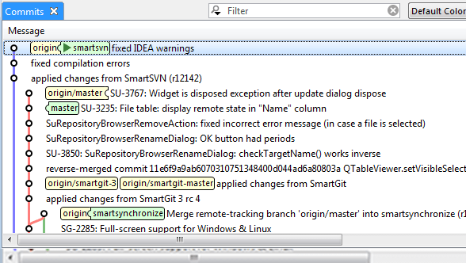

## Графические интерфейсы
Родная среда обитания Git — это терминал. Новые функции изначально доступны только там и лишь терминал поможет вам полностью контролировать всю мощь Git. Но текстовый интерфейс — не лучший выбор для всех задач; иногда графическое представление более предпочтительно, а некоторые пользователи чувствуют себя комфортней, орудуя мышкой.

Также стоит понимать, что разные интерфейсы служат разным целям. Некоторые Git клиенты ограничиваются лишь той функциональностью, которую их автор считает наиболее востребованной или эффективной. Учитывая это, ни один из представленных ниже инструментов не может быть «лучше» остальных: они просто предназначены для решения разных задач. Также стоит помнить, что всё, что можно сделать с помощью графического интерфейса, может быть выполнено и из консоли; командная строка по прежнему является местом, где у вас больше всего возможностей и контроля над вашими репозиториями.
####  GitHub для Mac и Windows
Компания GitHub выпустила два инструмента, ориентированных на рабочий процесс, а не на конкретные задачи: один для Windows, второй — для Mac. Эти клиенты — хороший пример процесс-ориентированного ПО: вместо предоставления доступа ко всей функциональности Git, они концентрируются на небольшом наборе фич, работающих вместе для достижения цели. Выглядят они примерно так:

####  Другие инструменты
Существует огромное множество других графических инструментов для работы с Git, начиная от специализированных, выполняющих одну задачу, заканчивая «комбайнами» покрывающими всю функциональность Git. На официальном сайте Git поддерживается в актуальном состоянии список наиболее популярных оболочек.

####   Git Kraken

Legendary Git GUI client for Windows, Mac & Linux
####  ##Intuitive UI/UX

> "Being an enthusiast for intuitive and seamless UIs, I was immediately drawn to this tool. When you start diving deeper, you realize the remarkable user experience that the developers at Axosoft have created."
> ###### Legendary Git Productivity
> "When we're modifying, staging, and committing, not needing to use Terminal commands is very valuable for me and my time. Being able to focus on what matters most is why I use GitKraken."

####  Smart Git

###### Get your commit done.

> SmartGit is a graphical Git client with support for GitHub, Bitbucket and GitLab. SmartGit runs on Windows, macOS and Linux.

###### One for All.
This powerful, multi-platform Git client has the same intuitive user interface on Windows, macOS and Linux:

- graphical merge and commit history
- drag and drop commit reordering, merging or rebase
- Use your SmartGit license on as many machines and operating systems you like.

###### Everything Included.
No need to install and configure additional tools.

_SmartGit includes_:

- command line Git client (Windows, macOS)
- Graphical Merge and Commit History
- Git-Flow
- SSH-client
- File Compare
- File Merge ("Conflict Solver")

###### Adopt to Your Needs and Workflows.
A commercial Git client should support your work-flows. You can customize SmartGit in various ways:

- Preferences for Merging, Rebasing
- Layout of certain views,
- External tools,
- External or built-in Compare or Conflict Solver tools,
- Keyboard shortcuts,
- Toolbars,
- Syntax coloring,
- Light and dark themes

---

[назад](./team.md "Вернуться назад")                                    [далее](./cli.md "Следующая страница")
